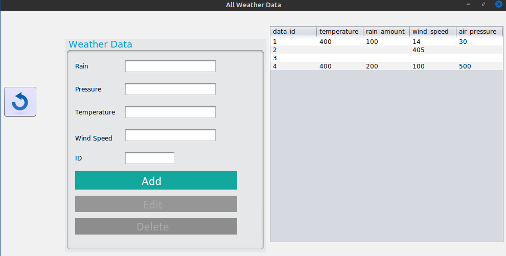

# Java WeatherData Management System
 #### This application is a WeatherData Management System which allows users to post and manage various kinds of weather data. It is built fully in JAVA and features a Swing User interface which is a GUI widget toolkit for Java. It is part of Oracle's Java Foundation Classes – an API for providing a graphical user interface for Java programs


## Installation
 #### 1.Download the zip file from this repository or fork this repository.
````bash
git fork https://github.com/vic-mwenda/Java-CRUD-app-for-a-weather-management-system.git
````
 #### 2.Extract the contents of the zip file to the Projects file in your IDE: 
 
 ##### - Linux: home/user/ideaprojects/

## Usage
#### 1.Build and run the java class 'weatherdata' in UI folder.

## Features
  #### 3.CRUD functionalities:  allows all users to create,read,update and delete their content in a managed format <br>

## TODO
#### 1.Fix delete,edit and update operations bugs
#### 2. Add User Management Logic.
#### 2. Add Instrument Management Logic.

## Contributing
#### Pull requests are welcome. For major changes, please open an issue first to discuss what you would like to change.Please make sure to update tests as appropriate.

## License
[MIT](https://choosealicense.com/licenses/mit/)

## Screenshots



# HAPPY CODING TEAM.

=======
